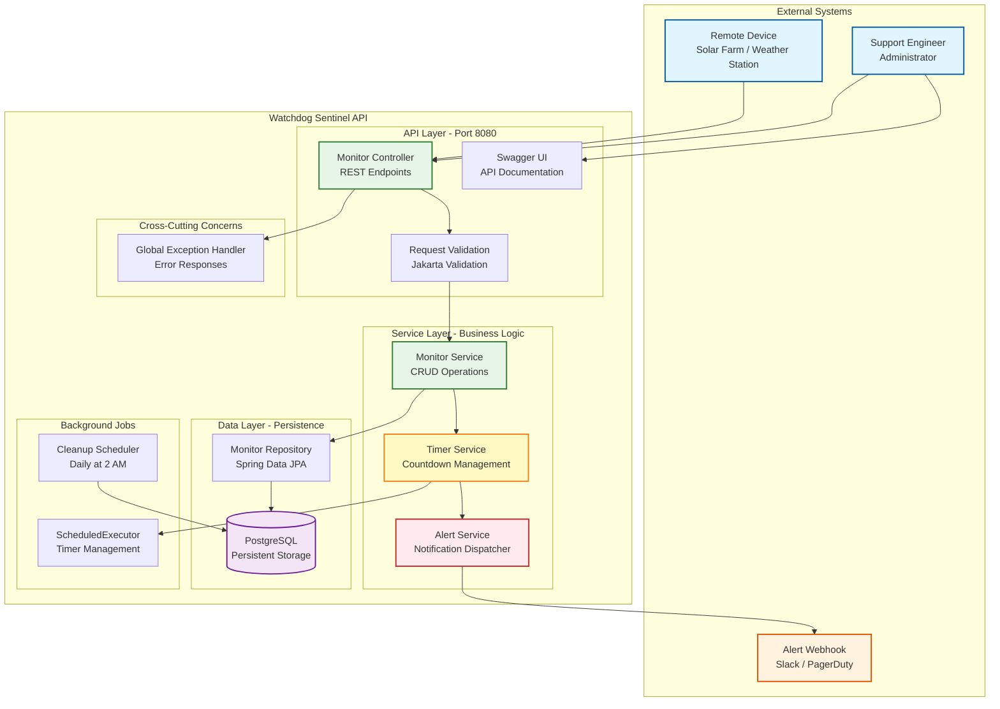
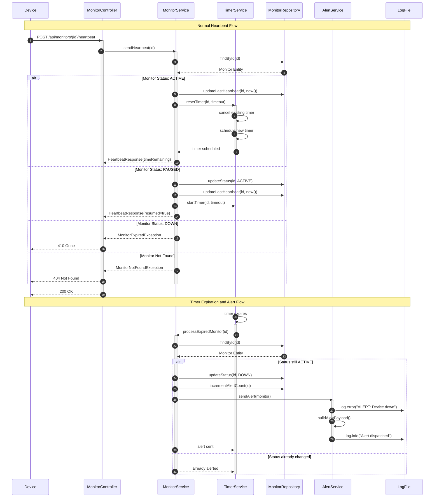
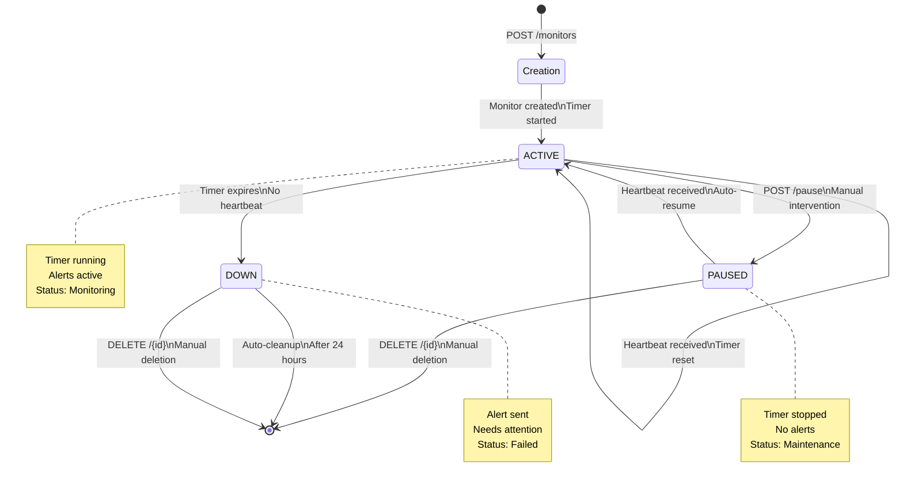
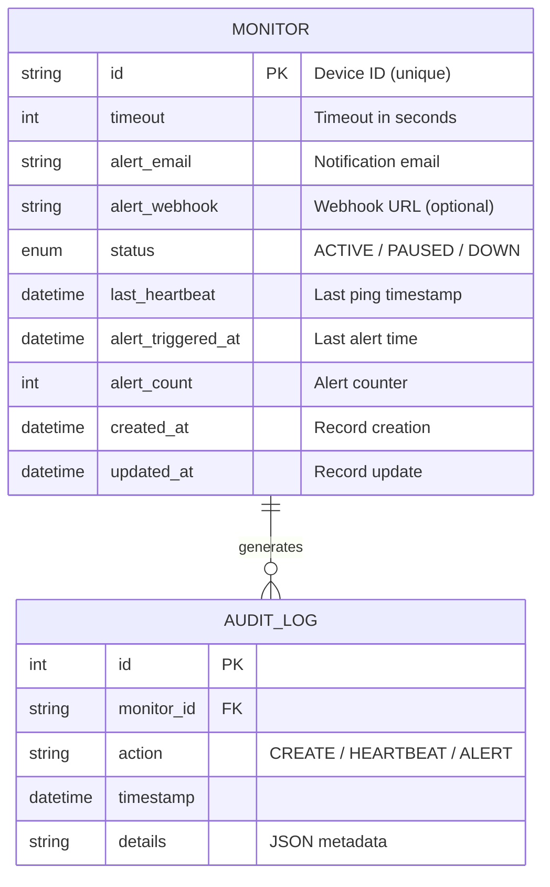
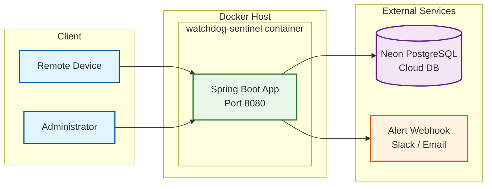

# Watchdog Sentinel API

> A Production-Ready Dead Man's Switch for Critical Infrastructure Monitoring

---

## Table of Contents

- [Overview](#overview)
- [System Architecture](#system-architecture)
- [Quick Start](#quick-start)
- [API Documentation](#api-documentation)
- [Project Structure](#project-structure)
- [Development](#development)
- [Deployment](#deployment)
- [The Developer's Choice Feature](#the-developers-choice-feature)
- [Monitoring and Observability](#monitoring-and-observability)
- [Troubleshooting](#troubleshooting)

---

## Overview

**Watchdog Sentinel** is a dead man's switch API designed for remote devices in low-connectivity environments such as solar farms, weather stations, and IoT sensors. It automatically detects when devices stop reporting and triggers alerts with no human intervention required.

### Core Capabilities

| Feature | Description |
|---|---|
| **Dead Man's Switch** | Automatic alerting when devices fail to send heartbeats |
| **Configurable Timeouts** | Per-device timeout from 10 seconds to 24 hours |
| **Heartbeat Reset** | REST endpoints to reset timers on demand |
| **Maintenance Mode** | Pause monitoring during repairs without false alarms |
| **Real-time Status** | Check device health at any moment |
| **Persistent Storage** | No data loss on server restart via PostgreSQL |

---

## System Architecture

### High-Level Architecture



### Sequence Diagram: Heartbeat and Alert Flow



### State Flow Diagram



### Database Schema



### Deployment Architecture



---

## Quick Start

### Prerequisites

- Java 17 or higher
- Maven 3.8+
- PostgreSQL (or use the provided Neon DB connection)

### Installation

```bash
# 1. Clone the repository
git clone https://github.com/jadofils/AmaliTech-DEG-Project-based-challenges.git
cd AmaliTech-DEG-Project-based-challenges/backend

# 2. Set environment variables
export DB_PASSWORD=your_db_password
export PORT=8080

# 3. Build the application
./mvnw clean package

# 4. Run the application
./mvnw spring-boot:run

# 5. Verify it is working
curl http://localhost:8080/api/monitors/health
```

**Expected Output:**

```json
{
  "status": "healthy",
  "timestamp": "2024-01-15T10:30:00",
  "service": "watchdog-sentinel"
}
```

---

## API Documentation

**Base URL:** `http://localhost:8080/api`

**Interactive Docs:** `http://localhost:8080/swagger-ui.html`

---

### 1. Create Monitor

Registers a new device for heartbeat monitoring.

```
POST /monitors
Content-Type: application/json
```

**Request Body:**

```json
{
  "id": "solar-panel-001",
  "timeout": 60,
  "alert_email": "admin@critmon.com",
  "alert_webhook": "https://your-slack-webhook.com"
}
```

| Field | Type | Required | Description |
|---|---|---|---|
| `id` | string | yes | Unique device identifier (3-100 chars) |
| `timeout` | integer | yes | Alert timeout in seconds (10 - 86400) |
| `alert_email` | string | yes | Where to send alerts |
| `alert_webhook` | string | no | HTTP endpoint for alert webhooks |

**Response `201 Created`:**

```json
{
  "id": "solar-panel-001",
  "timeout": 60,
  "status": "ACTIVE",
  "alertEmail": "admin@critmon.com",
  "lastHeartbeat": "2024-01-15T10:30:00",
  "createdAt": "2024-01-15T10:30:00",
  "message": "Monitor created successfully"
}
```

**Error `400 Bad Request`:**

```json
{
  "timestamp": "2024-01-15T10:30:00",
  "status": 400,
  "error": "Bad Request",
  "message": "Validation failed",
  "validation_errors": {
    "timeout": "Timeout must be at least 10 seconds"
  }
}
```

**Error `409 Conflict`:**

```json
{
  "timestamp": "2024-01-15T10:30:00",
  "status": 409,
  "error": "Conflict",
  "message": "Monitor already exists for device: solar-panel-001"
}
```

---

### 2. Send Heartbeat

Resets the countdown timer for a device.

```
POST /monitors/{id}/heartbeat
```

**Response `200 OK`:**

```json
{
  "deviceId": "solar-panel-001",
  "message": "Heartbeat received - timer reset",
  "timeRemaining": 60,
  "timestamp": "2024-01-15T10:31:00"
}
```

**Error `404 Not Found`:**

```json
{
  "timestamp": "2024-01-15T10:32:00",
  "status": 404,
  "error": "Not Found",
  "message": "Monitor not found for device: solar-panel-001"
}
```

**Error `410 Gone`:**

```json
{
  "timestamp": "2024-01-15T10:32:00",
  "status": 410,
  "error": "Gone",
  "message": "Monitor is expired. Create a new monitor to resume tracking."
}
```

---

### 3. Get Monitor Status

Retrieves the current status of a monitor.

```
GET /monitors/{id}/status
```

**Response `200 OK`:**

```json
{
  "id": "solar-panel-001",
  "status": "ACTIVE",
  "timeout": 60,
  "timeRemaining": 45,
  "lastHeartbeat": "2024-01-15T10:31:00",
  "createdAt": "2024-01-15T10:30:00",
  "alertCount": 0,
  "alertEmail": "admin@critmon.com"
}
```

**Status Values:**

| Status | Description |
|---|---|
| `ACTIVE` | Monitoring normally, timer running |
| `PAUSED` | Monitoring paused for maintenance |
| `DOWN` | Device missed heartbeat, alert triggered |

---

### 4. Pause Monitoring

Temporarily stops monitoring without triggering alerts.

```
POST /monitors/{id}/pause
```

**Response `200 OK`:**

```json
{
  "id": "solar-panel-001",
  "status": "PAUSED",
  "message": "Monitor paused. Send a heartbeat to auto-resume."
}
```

> **Note:** To resume, simply send a heartbeat. The monitor auto-transitions back to `ACTIVE`.

---

### 5. Delete Monitor

Permanently removes a monitor from the system.

```
DELETE /monitors/{id}
```

**Response `200 OK`:**

```json
{
  "message": "Monitor deleted successfully"
}
```

---

### 6. List All Monitors

Retrieves all monitors with optional filtering and pagination.

```
GET /monitors?status=ACTIVE&page=0&size=20&sortBy=createdAt&sortDir=desc
```

| Parameter | Default | Description |
|---|---|---|
| `status` | all | Filter by `ACTIVE`, `PAUSED`, or `DOWN` |
| `page` | `0` | Page number (0-indexed) |
| `size` | `20` | Items per page |
| `sortBy` | `createdAt` | Field to sort by |
| `sortDir` | `desc` | `asc` or `desc` |

**Response `200 OK`:**

```json
{
  "content": [
    {
      "id": "solar-panel-001",
      "timeout": 60,
      "status": "ACTIVE",
      "alertEmail": "admin@critmon.com",
      "lastHeartbeat": "2024-01-15T10:31:00",
      "createdAt": "2024-01-15T10:30:00"
    }
  ],
  "pageable": {
    "pageNumber": 0,
    "pageSize": 20
  },
  "totalElements": 1,
  "totalPages": 1
}
```

---

### 7. Health Check

```
GET /monitors/health
```

**Response `200 OK`:**

```json
{
  "status": "healthy",
  "timestamp": "2024-01-15T10:30:00",
  "service": "watchdog-sentinel",
  "activeTimers": 42,
  "database": "connected"
}
```

---

## Project Structure

```
backend/
src/main/java/com/watchdog/
├── WatchdogApplication.java
├── config/
│   ├── AsyncConfig.java
│   ├── TimerConfig.java
│   └── OpenAPIConfig.java
├── controller/
│   └── MonitorController.java
├── service/
│   ├── MonitorService.java
│   ├── TimerService.java
│   ├── AlertService.java
│   └── impl/
│       └── MonitorServiceImpl.java
├── repository/
│   └── MonitorRepository.java
├── model/
│   ├── entity/
│   │   └── Monitor.java
│   └── enums/
│       └── MonitorStatus.java
├── dto/
│   ├── request/
│   │   ├── CreateMonitorRequest.java
│   │   └── HeartbeatRequest.java
│   └── response/
│       ├── MonitorResponse.java
│       ├── HeartbeatResponse.java
│       └── StatusResponse.java
├── exception/
│   ├── GlobalExceptionHandler.java
│   ├── MonitorNotFoundException.java
│   ├── MonitorExpiredException.java
│   └── InvalidHeartbeatException.java
├── validation/
│   └── ValidTimeout.java
└── scheduler/
    └── CleanupScheduler.java
```

---

## Development

### Local Setup

```bash
# Use development profile
export SPRING_PROFILES_ACTIVE=dev

# Run with hot reload
./mvnw spring-boot:run

# Build JAR
./mvnw clean package
java -jar target/watchdog-sentinel-1.0.0.jar
```

### Running Tests

```bash
# Unit tests
./mvnw test

# Integration tests
./mvnw verify
```

---

## Deployment

### Environment Variables

| Variable | Description | Default |
|---|---|---|
| `PORT` | Server port | `8080` |
| `DB_PASSWORD` | PostgreSQL password | required |
| `SPRING_DATASOURCE_URL` | Full JDBC database URL | set in yaml |
| `ALERT_WEBHOOK_ENABLED` | Enable webhook alerts | `false` |
| `ALERT_WEBHOOK_URL` | Default webhook URL | none |
| `LOG_LEVEL` | Logging level | `INFO` |

### Docker Deployment

**1. Build the image:**

```bash
docker build -t watchdog-sentinel:latest .
```

**2. Run with Docker:**

```bash
docker run -d \
  --name watchdog-sentinel \
  -p 8080:8080 \
  -e DB_PASSWORD=your_db_password \
  -e SPRING_DATASOURCE_URL=jdbc:postgresql://your-db-host/neondb?sslmode=require \
  -e PORT=8080 \
  watchdog-sentinel:latest
```

**3. Run with Docker Compose:**

Create a `docker-compose.yml` at the project root:

```yaml
version: '3.8'

services:
  app:
    build: .
    container_name: watchdog-sentinel
    ports:
      - "8080:8080"
    environment:
      - DB_PASSWORD=${DB_PASSWORD}
      - SPRING_DATASOURCE_URL=${SPRING_DATASOURCE_URL}
      - PORT=8080
      - LOG_LEVEL=INFO
    env_file:
      - .env
    restart: unless-stopped
    healthcheck:
      test: ["CMD", "curl", "-f", "http://localhost:8080/api/monitors/health"]
      interval: 30s
      timeout: 10s
      retries: 3
      start_period: 40s
```

**4. Start with Docker Compose:**

```bash
# Start
docker-compose up -d

# View logs
docker-compose logs -f

# Stop
docker-compose down
```

**Dockerfile:**

```dockerfile
FROM eclipse-temurin:21-jdk-alpine AS build
WORKDIR /app
COPY mvnw pom.xml ./
COPY .mvn .mvn
RUN ./mvnw dependency:go-offline
COPY src ./src
RUN ./mvnw clean package -DskipTests

FROM eclipse-temurin:21-jre-alpine
WORKDIR /app
COPY --from=build /app/target/*.jar app.jar
EXPOSE 8080
ENTRYPOINT ["java", "-jar", "app.jar"]
```

---

## The Developer's Choice Feature

### Intelligent Alert Deduplication with Circuit Breaker

**Problem:** In environments with unstable connectivity, a device may go offline and recover repeatedly. A standard dead man's switch would fire an alert on every failure, flooding the on-call engineer with hundreds of notifications per hour — a problem known as alert fatigue.

**Solution:** An alert deduplication layer with a circuit breaker pattern that limits repeated alerts for the same device within a rolling time window.

**How It Works:**

```java
if (monitor.getAlertCount() == 0) {
    sendImmediateAlert();
} else if (timeSinceLastAlert > 1 hour) {
    sendAlert();
} else if (alertCount < 3) {
    sendAlertWithBackoff();
} else {
    circuitBreakerOpen();
}
```

**Impact:**

| Scenario | Without Feature | With Feature |
|---|---|---|
| Flaky connection | 100+ alerts per hour | 3 alerts maximum |
| Extended outage | Alert every 60 seconds | Alert once, then quiet |
| Maintenance window | False alarms | Paused, no alerts |
| After recovery | Manual cleanup | Auto-resume |

---

## Monitoring and Observability

### Prometheus Metrics

Add to `application.yaml`:

```yaml
management:
  endpoints:
    web:
      exposure:
        include: health,metrics,prometheus
  metrics:
    export:
      prometheus:
        enabled: true
```

Metrics endpoint: `http://localhost:8080/actuator/prometheus`

```
watchdog_monitors_total{status="active"} 150
watchdog_heartbeats_total 12500
watchdog_alerts_total 24
```

### Log Output Example

```
2024-01-15 10:30:00 INFO  - Created monitor: solar-panel-001 (timeout: 60s)
2024-01-15 10:31:00 INFO  - Heartbeat received: solar-panel-001, timer reset
2024-01-15 10:32:00 ERROR - ALERT: {"ALERT":"Device solar-panel-001 is down!", "time":"2024-01-15T10:32:00"}
2024-01-15 10:32:00 INFO  - Email simulated: To: admin@critmon.com
```

---

## Troubleshooting

| Issue | Symptom | Solution |
|---|---|---|
| Port already in use | `BindException` | Change port: `--server.port=8081` |
| DB connection failed | `PSQLException` | Verify `DB_PASSWORD` env variable is set |
| Timer not firing | No alerts in logs | Check `@EnableScheduling` is on main class |
| Memory leak | `OutOfMemoryError` | Increase heap: `-Xmx512m` |

### Debug Mode

```bash
export LOG_LEVEL=DEBUG
java -jar watchdog-sentinel.jar

# Attach remote debugger on port 5005
java -agentlib:jdwp=transport=dt_socket,server=y,suspend=n,address=5005 -jar watchdog-sentinel.jar
```

---

**Version:** 1.0.0 | **Java:** 17 | **Spring Boot:** 3.3.0 | **Database:** PostgreSQL (Neon)
