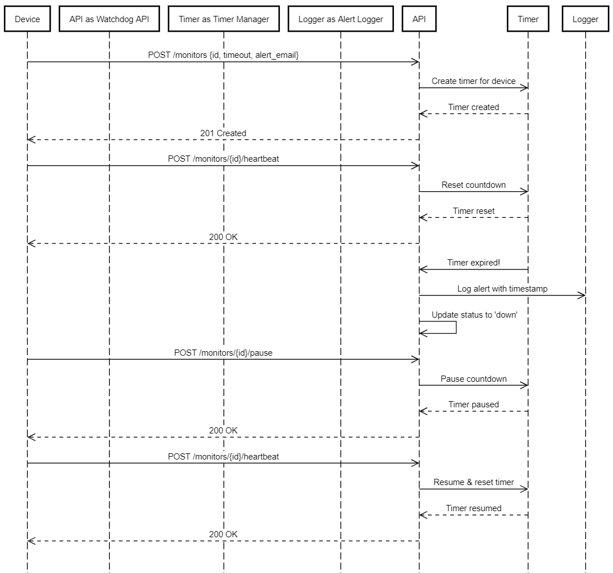
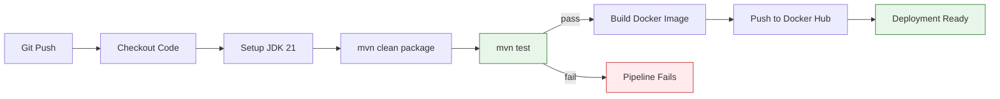

# Watchdog Sentinel API

> A Production-Ready Dead Man's Switch for Critical Infrastructure Monitoring

---

## Live Deployment

<div align="center">

### Base URL

# https://amalitech-deg-project-based-challenges-9f5j.onrender.com

| Link | Description |
|---|---|
| **[Health Check](https://amalitech-deg-project-based-challenges-9f5j.onrender.com/api/monitors/health)** | `GET /api/monitors/health` — Verify the API is running |
| **[Swagger UI](https://amalitech-deg-project-based-challenges-9f5j.onrender.com/swagger-ui/index.html)** | Interactive API documentation and testing |
| **[OpenAPI Docs](https://amalitech-deg-project-based-challenges-9f5j.onrender.com/api-docs)** | Raw OpenAPI JSON specification |
| **[All Monitors](https://amalitech-deg-project-based-challenges-9f5j.onrender.com/api/monitors)** | `GET /api/monitors` — List all registered monitors |
| **[All Audit Logs](https://amalitech-deg-project-based-challenges-9f5j.onrender.com/api/audit)** | `GET /api/audit` — System-wide audit trail |

</div>

---

## Table of Contents

- [Overview](#overview)
- [System Architecture](#system-architecture)
- [Quick Start](#quick-start)
- [API Documentation](#api-documentation)
- [Project Structure](#project-structure)
- [Development](#development)
- [DevOps](#devops)
  - [Docker](#docker)
  - [CI/CD with GitHub Actions](#cicd-with-github-actions)
  - [Deployment](#deployment)
- [The Developer's Choice Feature](#the-developers-choice-feature)
- [Monitoring and Observability](#monitoring-and-observability)
- [Troubleshooting](#troubleshooting)

---

## Overview

**Watchdog Sentinel** is a dead man's switch API designed for remote devices in low-connectivity environments such as solar farms, weather stations, and IoT sensors. It automatically detects when devices stop reporting and triggers alerts with no human intervention required.

### Core Capabilities

| Feature | Description |
|---|---|
| **Dead Man's Switch** | Automatic alerting when devices fail to send heartbeats |
| **Configurable Timeouts** | Per-device timeout from 10 seconds to 24 hours |
| **Heartbeat Reset** | REST endpoints to reset timers on demand |
| **Maintenance Mode** | Pause monitoring during repairs without false alarms |
| **Real-time Status** | Check device health at any moment |
| **Persistent Storage** | No data loss on server restart via PostgreSQL |

---

## System Architecture



**Figure: Watchdog Sentinel — Heartbeat and Alert Sequence Diagram**

This diagram illustrates the complete lifecycle of a monitor from the moment a device sends a heartbeat to the moment an alert is fired when the device goes silent.

**Reading the diagram — Normal Heartbeat Flow (top section):**

A remote device sends `POST /monitors/{id}/heartbeat` to the `MonitorController`. The controller delegates to `MonitorService`, which looks up the monitor in the database via `MonitorRepository`. If the monitor is `ACTIVE`, the last heartbeat timestamp is updated and `TimerService` cancels the existing countdown and schedules a fresh one. The device receives a `200 OK` with the time remaining. This cycle repeats on every heartbeat — as long as the device keeps pinging before the timer hits zero, no alert is ever fired.

**Reading the diagram — Timer Expiration and Alert Flow (bottom section):**

If the device stops sending heartbeats, the `TimerService` countdown reaches zero. It calls `processExpiredMonitor`, which checks the monitor status in the database. If still `ACTIVE`, the status is updated to `DOWN`, the alert count is incremented, and `AlertService.sendAlert()` is called asynchronously. The alert service applies the circuit breaker logic — if this is the first alert or the cooldown has passed, it logs the alert payload, simulates an email, and optionally fires a webhook. Every action is also written to the `AuditLog` table for traceability.

**Layer breakdown:**

| Layer | Components | Responsibility |
|---|---|---|
| API Layer | `MonitorController`, `AuditLogController` | Receives HTTP requests, validates input, returns responses |
| Service Layer | `MonitorService`, `TimerService`, `AlertService`, `AuditService` | Business logic, timer management, alert deduplication |
| Data Layer | `MonitorRepository`, `AuditLogRepository` | Persists monitors and audit logs to PostgreSQL |
| Background Jobs | `CleanupScheduler` | Auto-deletes DOWN monitors and old audit logs on a schedule |
| Cross-Cutting | `GlobalExceptionHandler`, `AsyncConfig` | Error handling, async thread pool |

---

## Quick Start

### Prerequisites

- Java 17 or higher
- Maven 3.8+
- PostgreSQL (or use the provided Neon DB connection)

### Installation

```bash
# 1. Clone the repository
git clone https://github.com/jadofils/AmaliTech-DEG-Project-based-challenges.git
cd AmaliTech-DEG-Project-based-challenges/backend

# 2. Set environment variables
export DB_PASSWORD=your_db_password
export PORT=8080

# 3. Build the application
./mvnw clean package

# 4. Run the application
./mvnw spring-boot:run

# 5. Verify it is working
curl http://localhost:8080/api/monitors/health
```

**Expected Output:**

```json
{
  "status": "healthy",
  "timestamp": "2024-01-15T10:30:00",
  "service": "watchdog-sentinel"
}
```

---

## API Documentation

**Base URL:** `https://amalitech-deg-project-based-challenges-9f5j.onrender.com/api`

**Local URL:** `http://localhost:8080/api`

**Swagger UI (Live):** [https://amalitech-deg-project-based-challenges-9f5j.onrender.com/swagger-ui/index.html](https://amalitech-deg-project-based-challenges-9f5j.onrender.com/swagger-ui/index.html)

**Swagger UI (Local):** `http://localhost:8080/swagger-ui/index.html`

---

### 1. Create Monitor

Registers a new device for heartbeat monitoring. Once created, the countdown timer starts immediately. If no heartbeat is received before the timeout expires, an alert is fired and the monitor status changes to `DOWN`. The device ID must be unique — attempting to register the same ID twice returns a `409 Conflict`.

```
POST /monitors
Content-Type: application/json
```

**Request Body:**

| Field | Type | Required | Description |
|---|---|---|---|
| `id` | string | yes | Unique device identifier (3-100 chars, letters/numbers/hyphens/underscores) |
| `timeout` | integer | yes | Seconds before alert fires (10 - 86400) |
| `alert_email` | string | yes | Email address to notify on alert |
| `alert_webhook` | string | no | HTTP endpoint to POST alert payload to |

**Test examples:**

```json
{
  "id": "solar-panel-001",
  "timeout": 60,
  "alert_email": "admin@critmon.com",
  "alert_webhook": ""
}
```

```json
{
  "id": "weather-station-042",
  "timeout": 120,
  "alert_email": "ops@critmon.com",
  "alert_webhook": ""
}
```

```json
{
  "id": "wind-turbine-007",
  "timeout": 30,
  "alert_email": "engineer@critmon.com",
  "alert_webhook": ""
}
```

```json
{
  "id": "iot-sensor-lab-3",
  "timeout": 300,
  "alert_email": "support@critmon.com",
  "alert_webhook": ""
}
```

**Response `201 Created`:**

```json
{
  "id": "solar-panel-001",
  "timeout": 60,
  "status": "ACTIVE",
  "alertEmail": "admin@critmon.com",
  "lastHeartbeat": "2024-01-15T10:30:00",
  "createdAt": "2024-01-15T10:30:00",
  "message": "Monitor created successfully"
}
```

**Error `400 Bad Request`** — validation failed:

```json
{
  "timestamp": "2024-01-15T10:30:00",
  "status": 400,
  "error": "Bad Request",
  "message": "Validation failed",
  "validation_errors": {
    "timeout": "Timeout must be at least 10 seconds"
  }
}
```

**Error `409 Conflict`** — device already registered:

```json
{
  "timestamp": "2024-01-15T10:30:00",
  "status": 409,
  "error": "Conflict",
  "message": "Monitor already exists for device: solar-panel-001"
}
```

---

### 2. Send Heartbeat

Proves the device is still alive by resetting the countdown timer back to the full timeout value. Call this endpoint from your device on a regular interval shorter than the timeout. If the monitor is `PAUSED`, sending a heartbeat automatically resumes it. If the monitor is `DOWN`, you must delete and re-register it.

```
POST /monitors/{id}/heartbeat
```

**Test examples** — use the IDs registered above:

```
POST /monitors/solar-panel-001/heartbeat
POST /monitors/weather-station-042/heartbeat
POST /monitors/wind-turbine-007/heartbeat
POST /monitors/iot-sensor-lab-3/heartbeat
```

**Response `200 OK`:**

```json
{
  "deviceId": "solar-panel-001",
  "message": "Heartbeat received - timer reset",
  "timeRemaining": 60,
  "resumed": false,
  "timestamp": "2024-01-15T10:31:00"
}
```

**Error `404 Not Found`** — device not registered:

```json
{
  "status": 404,
  "error": "Not Found",
  "message": "Monitor not found for device: solar-panel-001"
}
```

**Error `410 Gone`** — device is DOWN, must re-register:

```json
{
  "status": 410,
  "error": "Gone",
  "message": "Monitor is expired. Create a new monitor to resume tracking."
}
```

---

### 3. Get Monitor Status

Returns the full current state of a monitor. Use this to check whether a device is alive, how much time is left before an alert fires, and how many alerts have been triggered historically.

```
GET /monitors/{id}/status
```

**Test examples:**

```
GET /monitors/solar-panel-001/status
GET /monitors/weather-station-042/status
```

**Response `200 OK`:**

```json
{
  "id": "solar-panel-001",
  "status": "ACTIVE",
  "timeout": 60,
  "timeRemaining": 45,
  "lastHeartbeat": "2024-01-15T10:31:00",
  "createdAt": "2024-01-15T10:30:00",
  "alertCount": 0,
  "alertEmail": "admin@critmon.com"
}
```

**Status Values:**

| Status | Meaning |
|---|---|
| `ACTIVE` | Timer is running, device is being monitored |
| `PAUSED` | Timer stopped, no alerts will fire |
| `DOWN` | Timer expired, alert was triggered, device needs attention |

**ACTIVE** means the device is alive and the countdown is ticking. Every heartbeat resets the timer back to the full timeout value. As long as heartbeats keep arriving before the timer hits zero, the monitor stays ACTIVE indefinitely.

**PAUSED** means a maintenance technician has manually stopped the timer using the pause endpoint. The device can go completely silent without triggering any alert. The monitor stays PAUSED until a heartbeat is received, at which point it automatically transitions back to ACTIVE and the timer restarts.

**DOWN** means the timer ran out with no heartbeat received. The system has already fired an alert to the configured email and webhook. The device is considered offline and needs physical inspection or repair. A DOWN monitor cannot accept heartbeats — you must delete it and re-register the device to resume monitoring.

---

### 4. Pause Monitoring

Stops the countdown timer without triggering an alert. Use this when you are doing planned maintenance on a device and do not want false alarms. The monitor stays `PAUSED` indefinitely until a heartbeat is received, which auto-resumes it.

```
POST /monitors/{id}/pause
```

**Test examples:**

```
POST /monitors/wind-turbine-007/pause
POST /monitors/iot-sensor-lab-3/pause
```

**Response `200 OK`:**

```json
{
  "id": "wind-turbine-007",
  "status": "PAUSED",
  "message": "Monitor paused successfully. Send heartbeat to resume."
}
```

> To resume: simply send a heartbeat to the paused device. It auto-transitions back to `ACTIVE`.

---

### 5. Resume Monitoring

Manually resumes a `PAUSED` monitor and restarts the countdown timer. Sending a heartbeat also resumes automatically — this endpoint is for cases where you want to resume without counting as a heartbeat.

```
POST /monitors/{id}/resume
```

**Test example:**

```
POST /monitors/wind-turbine-007/resume
```

**Response `200 OK`:**

```json
{
  "id": "wind-turbine-007",
  "status": "ACTIVE",
  "message": "Monitor resumed successfully"
}
```

---

### 6. Delete Monitor

Permanently removes a monitor and cancels its timer. Use this when a device is decommissioned. This action cannot be undone — you must re-register the device to monitor it again.

```
DELETE /monitors/{id}
```

**Test example:**

```
DELETE /monitors/solar-panel-001
```

**Response `200 OK`:**

```json
{
  "message": "Monitor deleted successfully"
}
```

---

### 7. List All Monitors

Returns a paginated list of all monitors. Filter by status to see only active, paused, or down devices. Useful for building dashboards or bulk status checks.

```
GET /monitors?status=ACTIVE&page=0&size=20&sortBy=createdAt&direction=desc
```

| Parameter | Default | Description |
|---|---|---|
| `status` | all | Filter by `ACTIVE`, `PAUSED`, or `DOWN` |
| `page` | `0` | Page number (0-indexed) |
| `size` | `20` | Items per page |
| `sortBy` | `createdAt` | Field to sort by |
| `direction` | `desc` | `asc` or `desc` |

**Test examples:**

```
GET /monitors
GET /monitors?status=ACTIVE
GET /monitors?status=DOWN&page=0&size=10
```

**Response `200 OK`:**

```json
{
  "content": [
    {
      "id": "solar-panel-001",
      "timeout": 60,
      "status": "ACTIVE",
      "alertEmail": "admin@critmon.com",
      "lastHeartbeat": "2024-01-15T10:31:00",
      "createdAt": "2024-01-15T10:30:00"
    }
  ],
  "pageable": {
    "pageNumber": 0,
    "pageSize": 20
  },
  "totalElements": 4,
  "totalPages": 1
}
```

---

### 9. Get Audit Logs for a Device

Returns the full history of every action performed on a specific monitor — creation, heartbeats, pauses, resumes, deletes, and alerts — ordered from most recent to oldest. Use this to investigate why a device went DOWN or how many times it has been paused.

```
GET /api/audit/monitors/{id}
```

**Test examples:**

```
GET /api/audit/monitors/solar-panel-001
GET /api/audit/monitors/weather-station-042
```

**Response `200 OK`:**

```json
[
  {
    "id": 5,
    "monitorId": "solar-panel-001",
    "action": "HEARTBEAT",
    "timestamp": "2024-01-15T10:31:00",
    "details": "{\"timeRemaining\":60}"
  },
  {
    "id": 1,
    "monitorId": "solar-panel-001",
    "action": "CREATE",
    "timestamp": "2024-01-15T10:30:00",
    "details": "{\"timeout\":60,\"alertEmail\":\"admin@critmon.com\"}"
  }
]
```

---

### 10. Get Paginated Audit Logs for a Device

Same as above but paginated. Use this for devices with long histories.

```
GET /api/audit/monitors/{id}/paged?page=0&size=20
```

---

### 11. Get Audit Logs by Action Type

Returns all audit entries for a specific action type across all devices. Useful for finding every device that has ever triggered an alert, or every device that was paused.

```
GET /api/audit/action/{action}
```

**Valid action values:**

| Action | When it is logged |
|---|---|
| `CREATE` | A new monitor is registered |
| `HEARTBEAT` | A device sends a heartbeat |
| `ALERT` | A timer expires and an alert fires |
| `PAUSE` | A monitor is paused |
| `RESUME` | A monitor is resumed |
| `DELETE` | A monitor is deleted |

**Test examples:**

```
GET /api/audit/action/ALERT
GET /api/audit/action/HEARTBEAT
GET /api/audit/action/CREATE
```

**Response `200 OK`:**

```json
[
  {
    "id": 8,
    "monitorId": "wind-turbine-007",
    "action": "ALERT",
    "timestamp": "2024-01-15T10:35:00",
    "details": "{\"ALERT\":\"Device wind-turbine-007 is down!\",\"alert_count\":1}"
  }
]
```

---

### 12. Get All Audit Logs

Returns a paginated system-wide activity feed across all devices. Use this for compliance reporting or a global dashboard.

```
GET /api/audit?page=0&size=20
```

**Response `200 OK`:**

```json
{
  "content": [
    {
      "id": 10,
      "monitorId": "iot-sensor-lab-3",
      "action": "PAUSE",
      "timestamp": "2024-01-15T10:40:00",
      "details": "{\"previousStatus\":\"ACTIVE\"}"
    }
  ],
  "totalElements": 10,
  "totalPages": 1
}
```

Returns the current health of the API. Use this to verify the server is running, the database is connected, and to see how many timers are currently active in memory.

```
GET /monitors/health
```

**Response `200 OK`:**

```json
{
  "status": "healthy",
  "timestamp": "2024-01-15T10:30:00",
  "service": "watchdog-sentinel",
  "activeTimers": 4,
  "database": "connected"
}
```

---

### 13. Delete Audit Logs for a Device

Permanently deletes all audit log entries for a specific device. Use this when decommissioning a device.

```
DELETE /api/audit/monitors/{id}
```

**Response `200 OK`:**

```json
{ "deleted": 12, "monitorId": "solar-panel-001" }
```

---

### 14. Delete Audit Logs by Action Type

Deletes all entries of a specific action type across all devices.

```
DELETE /api/audit/action/{action}
```

**Response `200 OK`:**

```json
{ "deleted": 5, "action": "HEARTBEAT" }
```

---

### 15. Delete Audit Logs Older Than N Days

Deletes all entries older than the given number of days. The system also runs this automatically every day at 3 AM for logs older than 30 days.

```
DELETE /api/audit/older-than/{days}
```

**Test example** — delete logs older than 7 days:

```
DELETE /api/audit/older-than/7
```

**Response `200 OK`:**

```json
{ "deleted": 43, "olderThanDays": 7 }
```

> **Auto-cleanup:** The scheduler runs this automatically every day at 3 AM for logs older than 30 days. No manual action needed for routine housekeeping.

---

## Project Structure

```
backend/
src/main/java/com/watchdog/
├── WatchdogApplication.java
├── config/
│   ├── AsyncConfig.java
│   ├── TimerConfig.java
│   └── OpenAPIConfig.java
├── controller/
│   └── MonitorController.java
├── service/
│   ├── MonitorService.java
│   ├── TimerService.java
│   ├── AlertService.java
│   └── impl/
│       └── MonitorServiceImpl.java
├── repository/
│   └── MonitorRepository.java
├── model/
│   ├── entity/
│   │   └── Monitor.java
│   └── enums/
│       └── MonitorStatus.java
├── dto/
│   ├── request/
│   │   ├── CreateMonitorRequest.java
│   │   └── HeartbeatRequest.java
│   └── response/
│       ├── MonitorResponse.java
│       ├── HeartbeatResponse.java
│       └── StatusResponse.java
├── exception/
│   ├── GlobalExceptionHandler.java
│   ├── MonitorNotFoundException.java
│   ├── MonitorExpiredException.java
│   └── InvalidHeartbeatException.java
├── validation/
│   └── ValidTimeout.java
└── scheduler/
    └── CleanupScheduler.java
```

---

## Development

### Local Setup

```bash
# Use development profile
export SPRING_PROFILES_ACTIVE=dev

# Run with hot reload
./mvnw spring-boot:run

# Build JAR
./mvnw clean package
java -jar target/watchdog-sentinel-1.0.0.jar
```

### Running Tests

```bash
# Unit tests
./mvnw test

# Integration tests
./mvnw verify
```

---

## DevOps

This project uses Docker for containerization and GitHub Actions for automated CI/CD. Every push to the repository triggers a build and test pipeline. On success, a Docker image is built and pushed to Docker Hub automatically.

---

## Docker

The application is fully containerized using a multi-stage Dockerfile. The first stage builds the JAR using JDK 21, and the second stage runs it using a lightweight JRE 21 Alpine image to keep the final image size small.

**Dockerfile stages:**

```dockerfile
# Stage 1 - Build
FROM eclipse-temurin:21-jdk-alpine AS build
WORKDIR /app
COPY mvnw . && COPY .mvn .mvn && COPY pom.xml .
RUN ./mvnw dependency:go-offline -B
COPY src ./src
RUN ./mvnw clean package -DskipTests

# Stage 2 - Run
FROM eclipse-temurin:21-jre-alpine
WORKDIR /app
COPY --from=build /app/target/*.jar app.jar
EXPOSE 8080
ENTRYPOINT ["sh", "-c", "java $JAVA_OPTS -jar app.jar"]
```

**Build and run manually:**

```bash
# Build the image
docker build -t watchdog-sentinel:latest .

# Run the container
docker run -d \
  --name watchdog-sentinel \
  -p 8080:8080 \
  -e DB_PASSWORD=your_db_password \
  watchdog-sentinel:latest
```

**Run with Docker Compose:**

The `compose.yaml` file defines the full application stack. It loads credentials from `.env` and includes a health check on `/api/monitors/health`.

```bash
# Start
docker-compose up -d

# View logs
docker-compose logs -f

# Stop
docker-compose down
```

**compose.yaml overview:**

```yaml
services:
  app:
    build: .
    ports:
      - "8080:8080"
    env_file:
      - .env
    healthcheck:
      test: ["CMD", "wget", "--spider", "http://localhost:8080/api/monitors/health"]
      interval: 30s
      retries: 3
```

---

## CI/CD with GitHub Actions

The pipeline is defined in `.github/workflows/ci-cd.yml` and runs automatically on every push to `feature/watchdog-api` and `main`, and on every pull request targeting `main`.

**Pipeline flow:**



**Job 1 — Build and Test** (runs on every push):
- Checks out the code
- Sets up JDK 21 with Maven cache
- Builds the project with `mvn clean package`
- Runs all tests with DB credentials from GitHub Secrets
- Uploads the JAR as a build artifact

**Job 2 — Docker Build** (runs only after Job 1 passes):
- Builds the Docker image using the multi-stage Dockerfile
- Pushes two tags to Docker Hub:
  - `latest` — always points to the most recent build
  - `<git-sha>` — immutable tag for rollback

**Required GitHub Secrets:**

Go to your repository → `Settings` → `Secrets and variables` → `Actions` and add:

| Secret | Description |
|---|---|
| `DB_PASSWORD` | PostgreSQL password for Neon DB |
| `SPRING_DATASOURCE_URL` | Full JDBC connection URL |
| `DOCKER_USERNAME` | Your Docker Hub username |
| `DOCKER_PASSWORD` | Your Docker Hub password or access token |

---

## Deployment

### Environment Variables

| Variable | Description | Default |
|---|---|---|
| `PORT` | Server port | `8080` |
| `DB_PASSWORD` | PostgreSQL password | required |
| `SPRING_DATASOURCE_URL` | Full JDBC database URL | set in yaml |
| `ALERT_WEBHOOK_ENABLED` | Enable webhook alerts | `false` |
| `ALERT_WEBHOOK_URL` | Default webhook URL | none |
| `LOG_LEVEL` | Logging level | `INFO` |

### Run from Docker Hub

Once the CI/CD pipeline pushes the image, anyone can run it with:

```bash
docker pull jadofils/watchdog-sentinel:latest

docker run -d \
  --name watchdog-sentinel \
  -p 8080:8080 \
  -e DB_PASSWORD=your_password \
  -e SPRING_DATASOURCE_URL=jdbc:postgresql://your-db-host/neondb?sslmode=require \
  jadofils/watchdog-sentinel:latest
```

**Dockerfile:**

```dockerfile
FROM eclipse-temurin:21-jdk-alpine AS build
WORKDIR /app
COPY mvnw pom.xml ./
COPY .mvn .mvn
RUN ./mvnw dependency:go-offline
COPY src ./src
RUN ./mvnw clean package -DskipTests

FROM eclipse-temurin:21-jre-alpine
WORKDIR /app
COPY --from=build /app/target/*.jar app.jar
EXPOSE 8080
ENTRYPOINT ["java", "-jar", "app.jar"]
```

---

## The Developer's Choice Feature

### Intelligent Alert Deduplication with Circuit Breaker

**Why this was added:**
In environments with unstable connectivity — solar farms, remote weather stations, IoT sensors — a device may go offline and recover repeatedly within a short period. A standard dead man's switch fires an alert on every single failure. This floods the on-call engineer with hundreds of notifications per hour, a well-known problem called **alert fatigue**. Engineers start ignoring alerts, which defeats the entire purpose of the monitoring system.

**This is not AI.** It is a rule-based circuit breaker algorithm — a proven pattern from distributed systems engineering. No machine learning is involved. It makes decisions purely based on alert count and time elapsed since the last alert.

**It does not need its own endpoint.** The logic runs internally inside `AlertService` every time a timer expires. It is completely transparent to the device. The device just stops sending heartbeats — the system decides intelligently whether to fire an alert or suppress it.

**How it works:**

```java
// First failure: alert immediately
if (alertCount == 0) {
    sendImmediateAlert();
}
// Cooldown passed (>60 min since last alert): reset and alert again
else if (minutesSinceLastAlert > 60) {
    sendAlert();
}
// Within the hour but under the cap: alert with backoff
else if (alertCount < 3) {
    sendAlertWithBackoff();
}
// Circuit breaker open: suppress alert, log warning
else {
    log.warn("Circuit breaker ENGAGED - alert suppressed");
}
```

**Impact in real scenarios:**

| Scenario | Without Feature | With Feature |
|---|---|---|
| Flaky connection | 100+ alerts per hour | 3 alerts maximum |
| Extended outage | Alert every 60 seconds | Alert once, then quiet |
| Maintenance window | False alarms | Paused, no alerts |
| After 1 hour cooldown | Still flooding | Circuit resets, alerts resume |
| After recovery | Manual cleanup needed | Auto-resume on heartbeat |

**What the alert payload includes:**

```json
{
  "ALERT": "Device solar-panel-001 is down!",
  "time": "2024-01-15T10:32:00",
  "device_id": "solar-panel-001",
  "alert_email": "admin@critmon.com",
  "type": "timeout",
  "timeout_seconds": 60,
  "last_heartbeat": "2024-01-15T10:31:00",
  "alert_count": 2,
  "circuit_breaker_status": "CLOSED"
}
```

When the circuit breaker engages, the log shows:

```
WARN - Circuit breaker ENGAGED for device: solar-panel-001 - too many alerts (3 in last hour)
```

When the cooldown passes and the circuit resets:

```
INFO - Circuit breaker RESET for device: solar-panel-001 - cooldown period passed
```

---

## Monitoring and Observability

### Prometheus Metrics

Add to `application.yaml`:

```yaml
management:
  endpoints:
    web:
      exposure:
        include: health,metrics,prometheus
  metrics:
    export:
      prometheus:
        enabled: true
```

Metrics endpoint: `http://localhost:8080/actuator/prometheus`

```
watchdog_monitors_total{status="active"} 150
watchdog_heartbeats_total 12500
watchdog_alerts_total 24
```

### Log Output Example

```
2024-01-15 10:30:00 INFO  - Created monitor: solar-panel-001 (timeout: 60s)
2024-01-15 10:31:00 INFO  - Heartbeat received: solar-panel-001, timer reset
2024-01-15 10:32:00 ERROR - ALERT: {"ALERT":"Device solar-panel-001 is down!", "time":"2024-01-15T10:32:00"}
2024-01-15 10:32:00 INFO  - Email simulated: To: admin@critmon.com
```

---

## Troubleshooting

| Issue | Symptom | Solution |
|---|---|---|
| Port already in use | `BindException` | Change port: `--server.port=8081` |
| DB connection failed | `PSQLException` | Verify `DB_PASSWORD` env variable is set |
| Timer not firing | No alerts in logs | Check `@EnableScheduling` is on main class |
| Memory leak | `OutOfMemoryError` | Increase heap: `-Xmx512m` |

### Debug Mode

```bash
export LOG_LEVEL=DEBUG
java -jar watchdog-sentinel.jar

# Attach remote debugger on port 5005
java -agentlib:jdwp=transport=dt_socket,server=y,suspend=n,address=5005 -jar watchdog-sentinel.jar
```

---

**Version:** 1.0.0 | **Java:** 17 | **Spring Boot:** 3.3.0 | **Database:** PostgreSQL (Neon)
